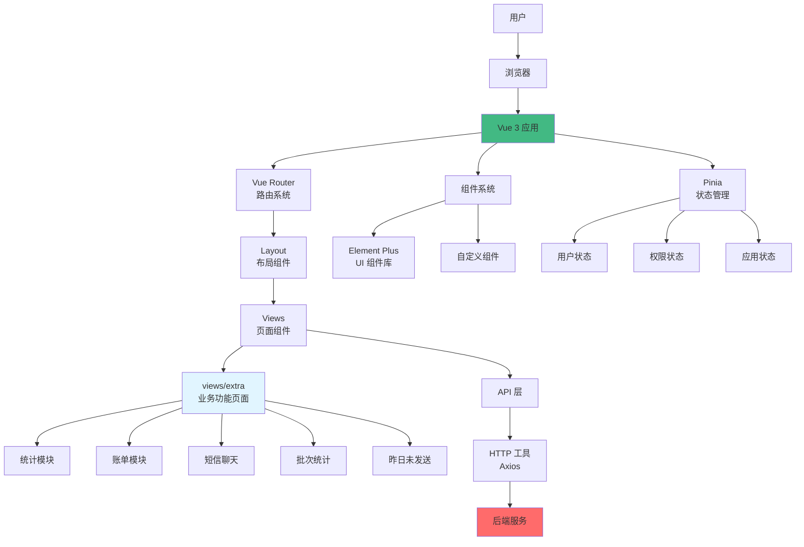
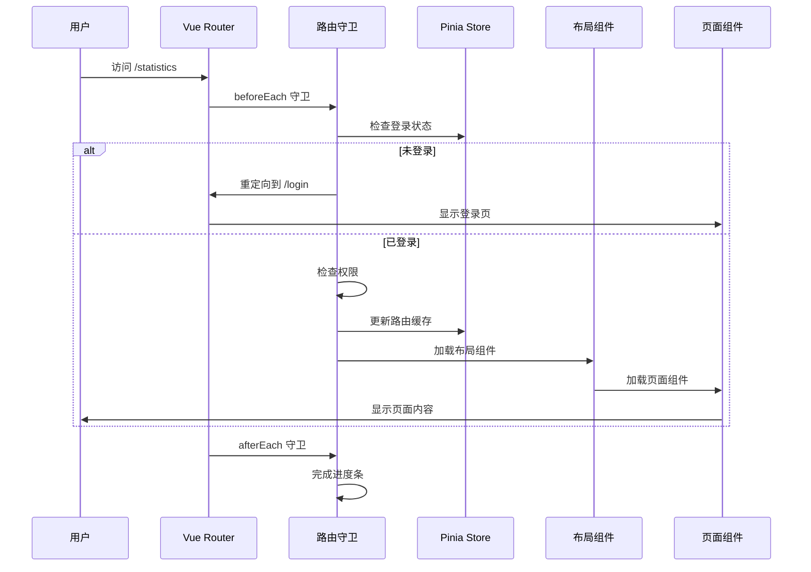
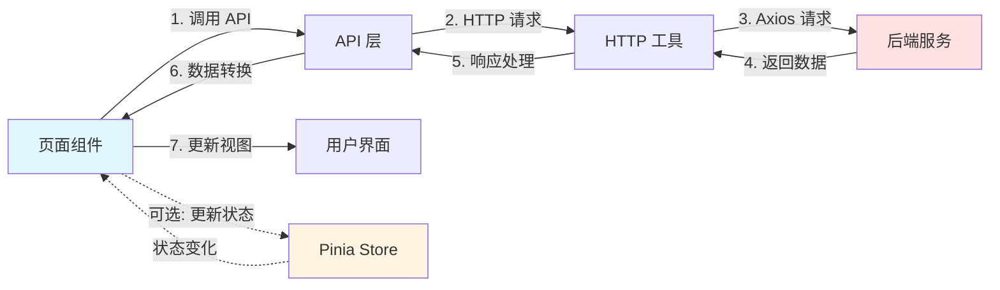
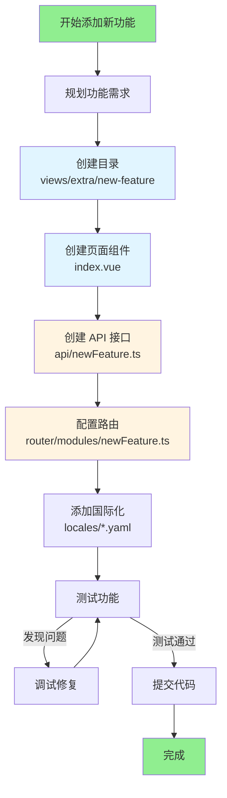
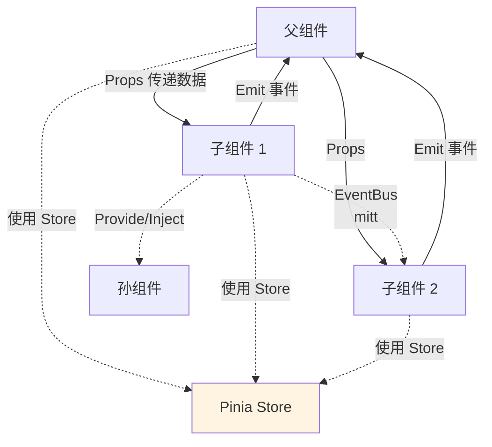
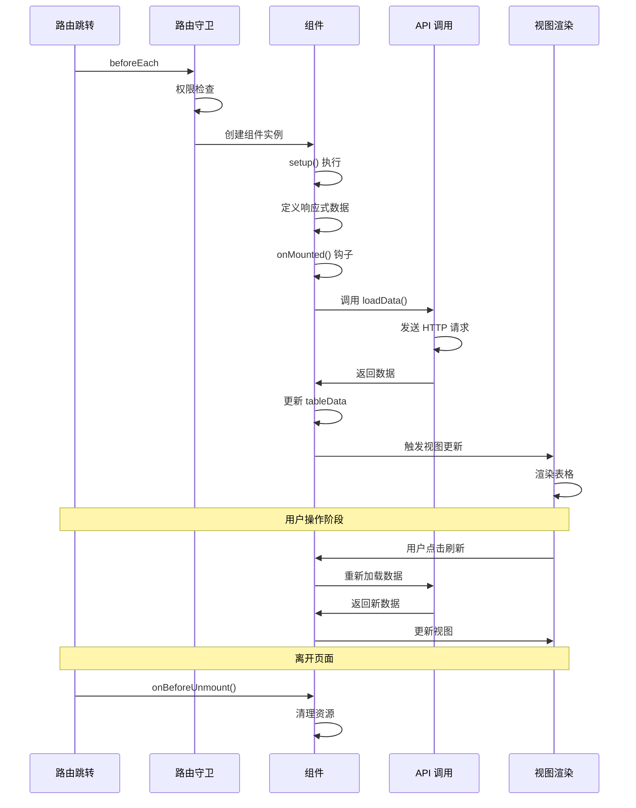
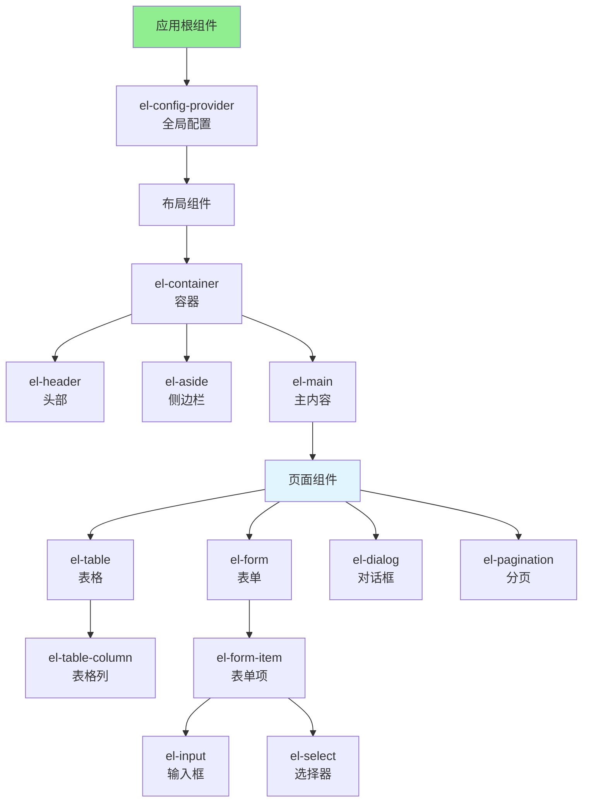
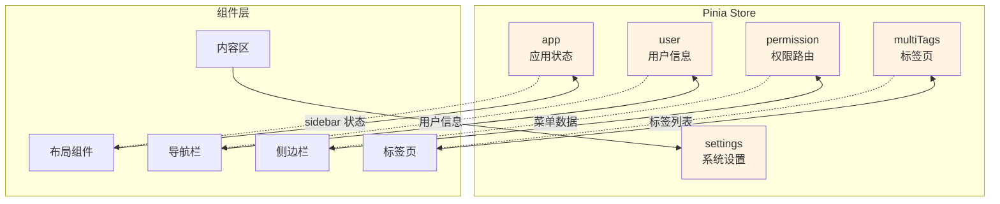
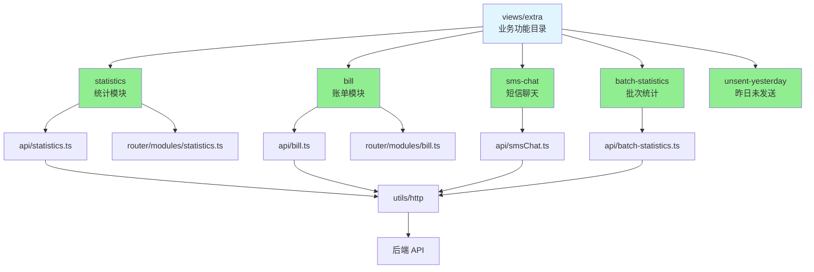
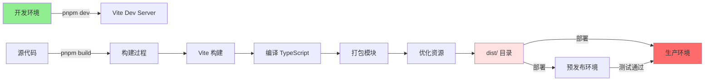

# Pure Admin Thin 架构图解

本文档使用可视化图表展示项目架构，帮助快速理解系统设计。

## 系统架构总览



## 目录结构树

```
Pure-Admin-Thin/
│
├── 📁 build/                  # 构建配置
│   ├── plugins.ts            # Vite 插件
│   ├── optimize.ts           # 依赖优化
│   └── utils.ts              # 构建工具
│
├── 📁 locales/                # 国际化
│   ├── zh-CN.yaml           # 中文
│   └── en.yaml              # 英文
│
├── 📁 public/                 # 静态资源
│
├── 📁 src/                    # 源代码 ⭐
│   │
│   ├── 📁 api/               # API 接口层
│   │   ├── user.ts          # 用户接口
│   │   ├── statistics.ts    # 统计接口
│   │   ├── bill.ts          # 账单接口
│   │   └── ...
│   │
│   ├── 📁 assets/            # 资源文件
│   │   ├── iconfont/        # 图标字体
│   │   └── svg/             # SVG 图标
│   │
│   ├── 📁 components/        # 全局组件
│   │   ├── ReIcon/          # 图标组件
│   │   ├── ReAuth/          # 权限组件
│   │   ├── ReDialog/        # 对话框
│   │   └── ...
│   │
│   ├── 📁 config/            # 配置文件
│   │
│   ├── 📁 directives/        # 自定义指令
│   │
│   ├── 📁 layout/            # 布局组件
│   │   ├── components/      # 布局子组件
│   │   │   ├── lay-navbar/  # 导航栏
│   │   │   ├── lay-sidebar/ # 侧边栏
│   │   │   ├── lay-tag/     # 标签页
│   │   │   └── ...
│   │   └── index.vue        # 主布局
│   │
│   ├── 📁 plugins/           # 插件配置
│   │   ├── i18n/            # 国际化插件
│   │   └── elementPlus/     # Element Plus
│   │
│   ├── 📁 router/            # 路由配置 ⭐
│   │   ├── modules/         # 路由模块
│   │   │   ├── home.ts
│   │   │   ├── statistics.ts
│   │   │   ├── bill.ts
│   │   │   └── ...
│   │   ├── index.ts         # 路由主文件
│   │   └── utils.ts         # 路由工具
│   │
│   ├── 📁 store/             # 状态管理 ⭐
│   │   ├── modules/         # 状态模块
│   │   │   ├── app.ts       # 应用状态
│   │   │   ├── user.ts      # 用户状态
│   │   │   ├── permission.ts # 权限状态
│   │   │   └── ...
│   │   └── index.ts         # Store 导出
│   │
│   ├── 📁 style/             # 全局样式
│   │   ├── reset.scss       # 重置样式
│   │   ├── index.scss       # 主样式
│   │   └── tailwind.css     # Tailwind
│   │
│   ├── 📁 utils/             # 工具函数
│   │   ├── http/            # HTTP 封装
│   │   ├── auth.ts          # 认证工具
│   │   ├── message.ts       # 消息提示
│   │   └── ...
│   │
│   ├── 📁 views/             # 页面组件 ⭐⭐⭐
│   │   ├── 📁 extra/        # 业务功能页面（核心开发目录）
│   │   │   ├── statistics/  # 统计模块
│   │   │   ├── bill/        # 账单模块
│   │   │   ├── sms-chat/    # 短信聊天
│   │   │   ├── batch-statistics/ # 批次统计
│   │   │   └── unsent-yesterday/ # 昨日未发送
│   │   │
│   │   ├── error/           # 错误页面
│   │   ├── login/           # 登录页面
│   │   ├── permission/      # 权限页面
│   │   └── welcome/         # 欢迎页
│   │
│   ├── App.vue              # 根组件
│   └── main.ts              # 应用入口
│
├── 📄 package.json           # 项目依赖
├── 📄 vite.config.ts         # Vite 配置
├── 📄 tsconfig.json          # TypeScript 配置
└── 📄 ARCHITECTURE.md        # 架构文档
```

## 路由系统流程



## 数据流向



## 添加新功能的流程图



## 组件通信模式



## 页面组件生命周期



## Element Plus 组件架构



## 状态管理架构



## views/extra 模块架构



## 构建和部署流程



---

## 图例说明

- 🟢 绿色: 入口/出口节点
- 🔵 蓝色: 核心业务模块
- 🟡 黄色: 状态管理/配置
- 🔴 红色: 外部服务/生产环境
- 实线箭头: 直接调用/依赖
- 虚线箭头: 数据流向/状态变化

## 查看建议

1. 使用支持 Mermaid 的 Markdown 查看器（如 GitHub、VS Code + Mermaid 插件）
2. 在线查看: https://mermaid.live/
3. 导出为图片后查看

---

**相关文档**:
- [ARCHITECTURE.md](./ARCHITECTURE.md) - 完整架构文档
- [docs/README.md](./docs/README.md) - 文档索引
- [docs/QUICK_REFERENCE.md](./docs/QUICK_REFERENCE.md) - 快速参考
